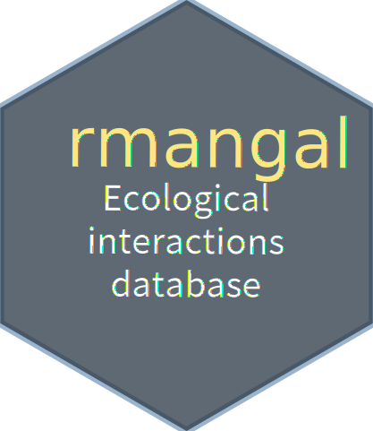

# rmangal :package:

[](https://travis-ci.org/mangal-wg/rmangal)
[](https://ci.appveyor.com/project/KevCaz/rmangal)
[](https://codecov.io/gh/mangal-wg/rmangal)
[](https://www.repostatus.org/#active)
[](http://www.r-pkg.org/badges/version/rmangal)


A package to retrieve and explore data from the ecological interactions database MANGAL.

- API documentation: https://mangal-wg.github.io/mangal-api/
- Data explorer: http://poisotlab.biol.umontreal.ca/#/
- Package documentation: https://mangal-wg.github.io/rmangal/


## Installation

### Development

So far, the development version can be installed via the [remotes](https://cran.r-project.org/web/packages/remotes/index.html) :package:

```r
devtools::install_github("mangal-wg/rmangal")
library("rmangal")
```

## Future developments :soon:

### Roadmap v2.2

- Develop functions to retrieve traits and environment attached to nodes (v2.1)
- Facilitate user publication of new ecological networks with template (v2.2)
    - Create publication S3 object
    - Generate the publication object based on template
    - Used suite of tests (`testthat`) to assist user on data integrity assessment
