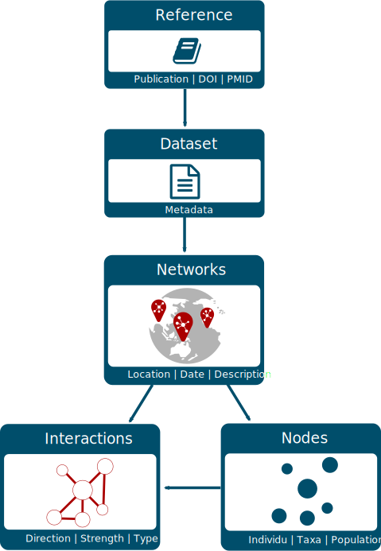

```{r setup, include = FALSE}
knitr::opts_chunk$set(
  collapse = TRUE,
  comment = "#>"
)
library(magrittr)
library(USAboundaries)
library(mapview)
library(igraph)
library(sf)
library(rmangal)
library(tibble)
```


# Context

## The Mangal project

[The Mangal project](http://www.mangal.io) aims at archiving published ecological networks and at easing their retrieval. To do so, Mangal:

1. uses a data specification for ecological networks [described in @poisot_mangal_2016];

2. archives ecological networks in a [PostgreSQL](https://www.postgresql.org/) database;

3. provides:
  - [a data explorer](http://poisotlab.biol.umontreal.ca/#/) to visualize and download data available;
  - a [RESTFUL Application Programming Interface (API)](https://mangal-wg.github.io/mangal-api/);
  - a client library for Julia: [Mangal.jl](https://github.com/PoisotLab/Mangal.jl);
  - a client of this API for R: the **rmangal** package described below.

Currently, the Mangal database includes 172 datasets representing over [1300
ecological networks](http://poisotlab.biol.umontreal.ca/#/). In 2016, a first
paper describing the project was published and introduced the first release of
**rmangal** [@poisot_mangal_2016]. Since then, the structure of the database has
been improved (new fields have been added), several ecological networks added
and the API entirely re-written. Consequently, [the first release of the
package](https://github.com/mangal-wg/rmangal-v1) (now archived) no longer works
with the current API and **rmangal** has therefore been completely revisited and
we introduces **rmangal v2.0**. in this vignette.


## Data structure

<br>

<div class = "row">
<div class = "col-md-6">
```{R echo = FALSE}

```
</div>
<div class = "col-md-6">

The diagram on the left side represents the structure of the Mangal database. All *references*
included in Mangal correspond to a specific publication that includes one or several *dataset(s)*. This dataset is
basically a collection of ecological *networks* whose *nodes* and *interactions* (edges) are stored
in separate tables. Below, we briefly describe the content of each table.

**References** -- Information pertaining to a reference (scientific article, book, online website,
etc.) characterizing an original collection of ecological networks. URLs of data and publication
sources are included as well as persistent identifiers (when available) such as digital object
identifiers (DOIs). This allows the user to retrieve more details about original publications using
appropriate R packages such as [crossref](https://docs.ropensci.org/rcrossref/).

**Datasets** -- Metadata of the datasets attached to a reference. It includes a general description
of the networks.

**Networks** -- Metadata of the networks attached to a dataset. It provides the sampling location, date and
specific description of the network.

**Nodes** -- Information on the population, taxa or individu in the network.
Each node has an original name / taxonomy and a taxonomic identifier extract from


**Interactions** -- Information on the interaction type (e.g mutualism,
predation, etc.), the strength, and the direction of the interaction between
two nodes.

</div>
</div>


## Authentification

So far, the `rmangal` package provides methods to get access to the datastore. Data requests
(performed via `httr::GET()`) do not require any authentification.

A bearer authentification strategy using [ORCID](https://orcid.org/) credentials
(as a third party services) has been implemented on all `POST`, `DELETE`, `PUT`
API operations to allow the user to add and delete new ecological to the data
base. These features are not currently included in the **rmangal** package, but
are under consideration for future major releases.


# How to use **rmangal**

## Overall approach

`rmangal` includes 6 search functions to quickly identify relevant entry included in the 5 tables described above and a extra table including taxonomy details about nodes:

1. `search_reference()`: search in the reference table, for instance the user can look for a specific `doi`;
2. `search_datasets()`: search among datasets using a keyword;
3. `search_networks()`: search networks based on a keyword or a geographical area;
4. `search_interactions()`: list all networks containing a specific interaction type;
5. `search_nodes()`: identify nodes based on nodes informations;
6. `search_taxonomy()`: identify nodes based on nodes informations;


All of these functions return specific objects containing the information needed
to retrieve the set of corresponding ecological networks with
`get_collection()`. Hence, the user can easily retrieve data in two steps:

```r
networks <- search_*() %>% get_collection()
```

If there is only one network to be retrieved, `get_collection()` returns a
`mgNetwork` object, otherwise it returns a object of class
`mgNetworksCollection` which is a collection (a list) of `mgNetwork` objects.
Once a collection of networks obtained, the user can easily display the
corresponding set of references using `get_citation()`:


```r
ref <- get_citation(networks)
```

Note that the aim of the 6 search functions is to offer flexible and efficient ways to request data from Mangal database. Below, we illustrate this in more details.


## Search functions

### Look up specific networks

As Mangal , network it

We can also search networks by keyword

```{R}
insect_coll <- search_networks(query="insect%")
glimpse(insect_coll)
```

If we are interested by a specific study area, we can easily filter networks based on their locations. stores data and coordinates system.

```{R}
area <- us_states(state = "california")
in_CA <- search_networks(area)
mapview(in_CA, legend = FALSE)
```

### List and search in datasets

We can list all datasets containing the word `lagoon` in the dataset description.

```{R}
lagoon <- search_datasets(query = 'lagoon')
```

In absence of keyword, `search_datasets()` will always list all datasets. All `search_*` functions
will have this same default behaviour.

```{R}
all_datasets <- search_datasets("", verbose = FALSE)
glimpse(all_datasets)
```


### Find networks by reference


```{R}
seifert_1979 <- search_reference(doi = "10.2307/1936064")
# Number of networks
nrow(seifert_1979$networks)
```


### Search for a specific interaction type

It is also easy to retrieve all interactions by type.

```{R}
# List all interaction type available
avail_type()
comp_interac <- search_interactions(type="competition")
# Number of competition interactions in mangal
nrow(comp_interac)
```

### Search for a specific taxa

We can search for taxa documented by the authors of the publication with `original = TRUE`.

```{R}
sr_ficus <- search_taxonomy("Ficus", verbose = FALSE)
```

Most of the nodes documented by authors will use scientific names. However, some
networks track interaction among individu by pasting the scientific name with
unique ID and thus lowering the number of matches return by `rmangal` for a
specific taxa. To avoid this problem, it is possible to instead query the
taxonomy backbone using `original = FALSE`. The taxonomy backbone contains a
homogeneized taxonomy done with taxize [@chamberlain_2019].

This function allows to search a taxa based on EOL, TSN, GBIF, COL, BOLD and NCBI IDs.

```{R}
glimpse(search_taxonomy(tsn = 28749))
glimpse(search_taxonomy(eol =  583069))
# tsn_acer <- search_taxonomy("Acer")$taxonomy.tsn
# taxize::classification(tsn_acer, db = "itis")
```

## Get networks associated to `search_*`

We can retrieve the ecological networks based on the `search_*()`.

```{R}
nets_lagoons <- get_collection(lagoon, verbose = FALSE)
nets_in_CA <- get_collection(in_CA, verbose = FALSE)
nets_competition <- get_collection(comp_interac, verbose = FALSE)
```

```{R}
nets_lagoons
```

Each network within the collection will always be a list wherein each level corresponds to a
specific table of the data structure described above.

```{R}
glimpse(nets_lagoons[[1]]$network)
glimpse(nets_lagoons[[1]]$nodes)
glimpse(nets_lagoons[[1]]$edges)
glimpse(nets_lagoons[[1]]$dataset)
glimpse(nets_lagoons[[1]]$reference)
```

## Coerce network to `igraph`

A collection of networks can easily be coerce as an `igraph` object.

```{R}
ig_laggons_coll <- as.igraph(nets_lagoons)
```

## Get BibTeX for the networks collection

We can easily get a BibTeX of all publications involved in the networks collection.

```{R}
get_citation(nets_in_CA)
```

## References
