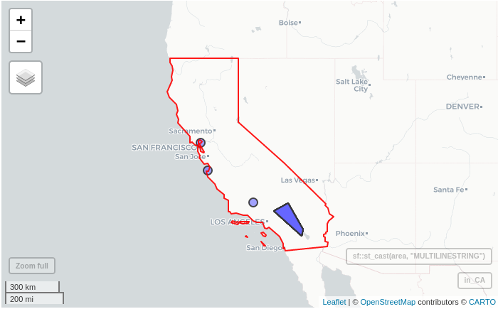
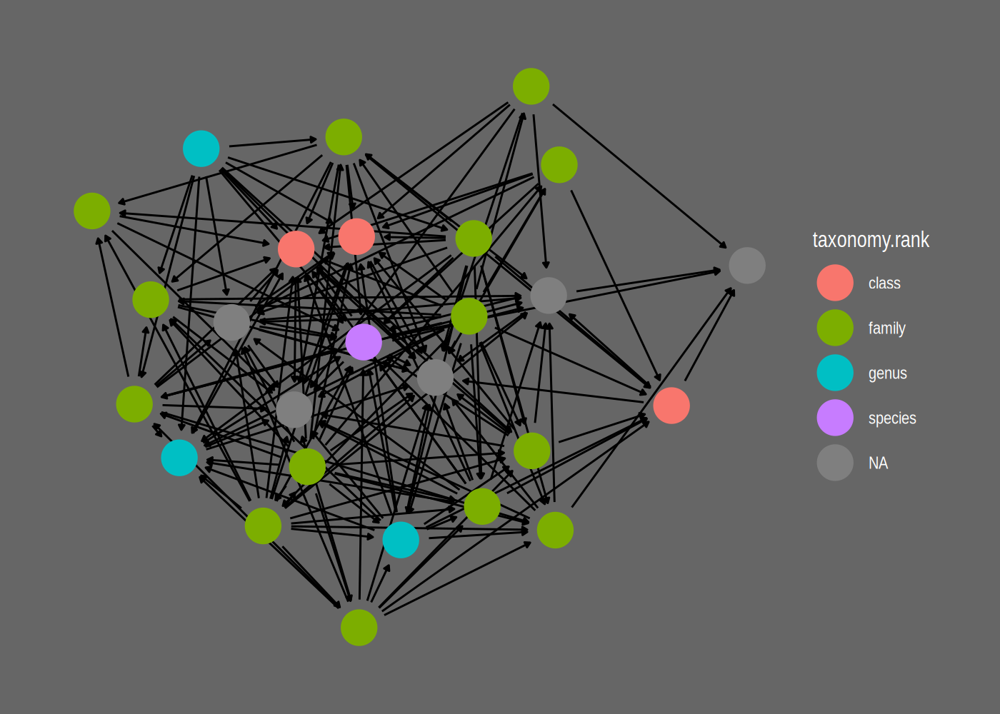

# Context


## The Mangal project

[The Mangal project](https://mangal.io) aims at archiving published ecological networks and at easing their retrieval. To do so, Mangal:

1. uses a data specification for ecological networks [described in @poisot_mangal_2016];

2. archives ecological networks in a [PostgreSQL](https://www.postgresql.org/) database;

3. provides:
  - [a data explorer](https://mangal.io/#/) to visualize and download data available;
  - a [RESTful Application Programming Interface (API)](https://mangal-interactions.github.io/mangal-api/);
  - a client library for Julia: [Mangal.jl](https://github.com/PoisotLab/Mangal.jl);
  - a client of this API for R: the **rmangal** package described below.

Currently, 172 datasets are including in the database representing over [1300 ecological
networks](https://mangal.io/#/network). In 2016, the first paper describing the project was
published and introduced the first release of **rmangal** [@poisot_mangal_2016]. Since then, the
structure of the database has been improved (new fields have been added), several ecological
networks added and the API entirely rewritten. Consequently, [the first release of the
**rmangal**](https://github.com/mangal-interactions/rmangal-v1) is obsolete (and archived) and we introduce
**rmangal v2.0** in this vignette.


## Data structure

<br>

<div class = "row">
<div class = "col-md-6">

</div>
<div class = "col-md-6">

The diagram on the left side represents the structure of the Mangal database. All *references*
included in Mangal correspond to a specific publication that includes one or several *dataset(s)*. This dataset is
basically a collection of ecological *networks* whose *nodes* and *interactions* (edges) are stored
in separate tables. Below, we briefly describe the content of each table.

**References** -- Information pertaining to a reference (scientific article, book, online website,
etc.) characterizing an original collection of ecological networks. URLs of data and publication
sources are included as well as persistent identifiers (when available) such as digital object
identifiers (DOIs). This allows the user to retrieve more details about original publications using
appropriate R packages such as [crossref](https://docs.ropensci.org/rcrossref/).

**Datasets** -- Metadata of the datasets attached to a reference. It includes a general description
of the networks.

**Networks** -- Metadata of the networks attached to a dataset. It provides the sampling location, date and
specific description of the network.

**Nodes** -- Information on the population, taxa or individu in the network. Each node has the
original taxon name documented and taxonomic backbone provided by all services embedded in taxize
[@chamberlain_2019].

**Interactions** -- Information on the interaction type (e.g. mutualism,
predation, etc.), the strength, and the direction of the interaction between
two nodes.

</div>
</div>


## Authentication

So far, the `rmangal` package provides methods to get access to the data store. Data requests
(performed via `httr::GET()`) do not require any authentication.

A bearer authentication strategy using [ORCID](https://orcid.org/) credentials
(as a third-party services) has been implemented on all `POST`, `DELETE`, `PUT`
API operations to allow the user to add and delete new ecological to the data
base. These features are not currently included in the **rmangal** package, but
are under consideration for future major releases.


# How to use **rmangal**

## Overall approach

In order to efficiently retrieve networks from the database, **rmangal**
includes 7 search functions querying the 5 tables described above as well as a table dedicated to the taxonomy backbone.

1. `search_references()`: search in the reference table, for instance the user can look for a specific `doi`;
2. `search_datasets()`: search among datasets using a keyword;
3. `search_networks()` and `search_networks_sf()`: search networks based on a keyword or a geographical area;
4. `search_interactions()`: list all networks containing a specific interaction type;
5. `search_nodes()`: identify nodes based on nodes information;
6. `search_taxonomy()`: identify nodes based on taxonomic names and unique identifiers.

All of these functions return specific class objects with the information needed
to retrieve the corresponding set of ecological networks with
`get_collection()`. Hence, the user can easily retrieve data in two steps:

```r
networks <- search_*() %>% get_collection()
```

Note that if there is only one network to be retrieved, `get_collection()`
returns a `mgNetwork` object, otherwise it returns an object of class
`mgNetworksCollection` which is a collection (a list) of `mgNetwork` objects.
Below, we exemplify how to use the search functions, how to get a collection of
networks and how to use other packages to carry out specific analyses.


## Search functions

In **rmangal**, every functions queries a specific table and allow only one
query at a time (see section [Batch analysis](#batch-analysis) to learn
how to perform more than one query). All the functions offer two ways to query
the corresponding table:

1. a keyword: in this case, the entries returned are the partial or full keyword match of any strings contained in the table;
2. a custom query: in this case, entries returned are exact matches.

Let's load **rmangal** as well as two helper packages:


```r
library(rmangal)
library(magrittr) # for the pipe %>%
library(tibble) # to use tibble (enhanced data frames)
```


### Search and list available datasets

Let's assume we are looking for ecological networks including species living in
lagoons. If we have no idea about any existing data set, the best starting point
is then to query the `dataset` table with `lagoon` as a keyword:


```r
lagoon <- search_datasets(query = "lagoon")
class(lagoon)
#> [1] "tbl_df"           "tbl"              "data.frame"       "mgSearchDatasets"
lagoon
#> # A tibble: 2 × 10
#>      id name        description                                     public created_at               updated_at               ref_id user_id references    networks     
#>   <int> <chr>       <chr>                                           <lgl>  <chr>                    <chr>                     <int>   <int> <list>        <list>       
#> 1    22 zetina_2003 Dietary matrix of the Huizache–Caimanero lagoon TRUE   2019-02-23T17:04:32.017Z 2019-02-23T17:04:32.017Z     22       3 <df [1 × 11]> <df [1 × 13]>
#> 2    52 yanez_1978  Food web of the Guerrero lagoon                 TRUE   2019-02-24T23:42:52.062Z 2019-02-24T23:42:52.062Z     53       3 <df [1 × 11]> <df [2 × 13]>
```

If the Mangal reference id containing the lagoon networks was known, we could build a custom query as follow:


```r
lagoon_zetina <- search_datasets(list(ref_id = 22))
lagoon_zetina
#> # A tibble: 1 × 10
#>      id name        description                                     public created_at               updated_at               ref_id user_id references    networks     
#>   <int> <chr>       <chr>                                           <lgl>  <chr>                    <chr>                     <int>   <int> <list>        <list>       
#> 1    22 zetina_2003 Dietary matrix of the Huizache–Caimanero lagoon TRUE   2019-02-23T17:04:32.017Z 2019-02-23T17:04:32.017Z     22       3 <df [1 × 11]> <df [1 × 13]>
```

Note that if an empty character is passed, i.e. `""`, all entries are returned. We can use this behavior to list all datasets available:


```r
all_datasets <- search_datasets("", verbose = FALSE)
head(all_datasets)
#> # A tibble: 6 × 10
#>      id name                  description                                                                        public created_at               updated_at               ref_id user_id references    networks
#>   <int> <chr>                 <chr>                                                                              <lgl>  <chr>                    <chr>                     <int>   <int> <list>        <list>  
#> 1     2 howking_1968          Insect activity recorded on flower at Lake Hazen, Ellesmere Island, N.W.T., Canada TRUE   2019-02-22T15:39:00.427Z 2019-02-22T15:39:00.427Z      2       2 <df [1 × 11]> <df>    
#> 2     7 lundgren_olesen_2005  Pollnator activity recorded on flowers, Uummannaq Island, Greenland, Danmark       TRUE   2019-02-22T20:04:25.322Z 2019-02-22T20:04:25.322Z      7       2 <df [1 × 11]> <df>    
#> 3     9 elberling_olesen_1999 Flower-visiting insect at Mt. Latnjatjarro, northern Sweden                        TRUE   2019-02-22T20:09:17.994Z 2019-02-22T20:09:17.994Z      9       2 <df [1 × 11]> <df>    
#> 4    14 johnston_1956         Predation by short-eared owls on a salicornia salt marsh                           TRUE   2019-02-22T21:10:45.269Z 2019-02-22T21:10:45.269Z     14       3 <df [1 × 11]> <df>    
#> 5    15 havens_1992           Pelagic communities of small lakes and ponds of the Adirondack                     TRUE   2019-02-23T01:47:06.347Z 2019-02-23T01:47:06.347Z     15       3 <df [1 × 11]> <df>    
#> 6    16 kemp_1977             Food web for the Crystal River estuary                                             TRUE   2019-02-23T03:02:31.697Z 2019-02-23T03:02:31.697Z     16       3 <df [1 × 11]> <df>
```

As shown in the diagram above, a dataset comes from a specific reference and `search_references()`
queries the reference table directly. A handy argument of this function is `doi` as it
allows to pass a Digital Object Identifier and so to retrieve all datasets attached to a specific
publication.


```r
zetina_2003 <- search_references(doi = "10.1016/s0272-7714(02)00410-9")
```


### Finding a specific network

We can also search by keyword across all networks.


```r
insect_coll <- search_networks(query = "insect%")
head(insect_coll)
#>     id                               name                     date
#> 1   18    mosquin_martin_1967_19650731_18 1965-07-31T00:00:00.000Z
#> 2  909 elberling_olesen_1999_19940823_909 1994-08-23T00:00:00.000Z
#> 3  948             kato_1993_19910901_948 1991-09-01T00:00:00.000Z
#> 4 1460         cornaby_1974_19680208_1460 1968-02-08T00:00:00.000Z
#> 5 1461         cornaby_1974_19680229_1461 1968-02-29T00:00:00.000Z
#> 6 1471    jiron_cartin_1981_19770101_1471 1977-01-01T00:00:00.000Z
#>                                                                                                                                             description public all_interactions               created_at
#> 1                                Occurence of flower-visiting insect on plant species, two miles north of Bailey Point, Melville Island, N.W.T., Canada   TRUE            FALSE 2019-02-22T18:38:37.491Z
#> 2                                                                                           Flower-visiting insect at Mt. Latnjatjarro, northern Sweden   TRUE            FALSE 2019-02-24T22:21:32.444Z
#> 3 Flower and anthophilous insect interactions in the primary cool-temperate subalpine forests and meadows at Mt. Kushigata, Yamanashi Prefecture, Japan   TRUE            FALSE 2019-02-25T20:52:09.499Z
#> 4                           The insect community of  a toad carrion in a tropical dry lowland forest at Finac La pacifica, Guanacaste Prov., Costa Rica   TRUE            FALSE 2019-03-01T18:30:50.890Z
#> 5                             The insect community of  a toad carrion in a tropical wet lowland forest near Rincon de Osa, Puntarenas Prov., Costa Rica   TRUE            FALSE 2019-03-01T18:30:57.419Z
#> 6                                              The insect community of a dog carcass in a premontane humid forest, University of Costa Rica, Costa Rica   TRUE            FALSE 2019-03-04T18:22:33.907Z
#>                 updated_at dataset_id user_id geom_type  geom_lon geom_lat
#> 1 2019-02-22T18:38:37.491Z          4       3     Point -114.9667       75
#> 2 2019-02-24T22:21:32.444Z          9       2     Point      18.5    68.35
#> 3 2019-02-25T20:52:09.499Z         66       2     Point  138.3833  35.5833
#> 4 2019-03-01T18:30:50.890Z         91       4     Point -85.09443  10.4568
#> 5 2019-03-01T18:30:57.419Z         91       4     Point -83.50833 8.534018
#> 6 2019-03-04T18:22:33.907Z         99       4     Point -84.07651 9.933982
```

It is also possible to retrieve all networks based on interaction types involved:


```r
comp_interac <- search_interactions(type = "competition")
# Number of competition interactions in mangal
nrow(comp_interac)
#> [1] 12
```

`search_networks_sf()` handles spatial queries: argument `query_sf` takes a
[`sf`](https://cran.r-project.org/package=sf) object as input and returns all
networks included in the spatial extent of this object. For instance, one can
retrieve all networks found in North Carolina included in Mangal like so:


```r
library(sf)
library(mapview)

area <- sf::st_read(system.file("shape/nc.shp", package="sf"))
#> Reading layer `nc' from data source `/usr/lib/R/site-library/sf/shape/nc.shp' using driver `ESRI Shapefile'
#> Simple feature collection with 100 features and 14 fields
#> Geometry type: MULTIPOLYGON
#> Dimension:     XY
#> Bounding box:  xmin: -84.32385 ymin: 33.88199 xmax: -75.45698 ymax: 36.58965
#> Geodetic CRS:  NAD27
in_NC <- search_networks_sf(area, verbose = FALSE)
```


```r
mapView(
  st_geometry(area), 
  color = "red", 
  legend = FALSE, 
  col.regions = "#FF000033"
  ) + mapView(in_NC, legend = FALSE) 
#> Error in path.expand(path): invalid 'path' argument
```



### Search for a specific taxon

The user can easily identify networks including a specific taxonomic entity
with `search_taxonomy()`:


```r
sr_ficus <- search_taxonomy("Ficus")
```

This function allows to search for a specific taxonomic entity using it's validated name or unique identifiers, i.e. EOL, TSN, GBIF, COL, BOLD and NCBI IDs. Taxon names of the `taxonomy` table were validated with
TNRS (see <https://tnrs.biendata.org/>) and/or GNR (see <https://resolver.globalnames.org/>). The taxon names in this table
might not be the taxon name documented in the original publication.
In order to identify relevant networks with the original name, use
[search_nodes()].

The validation of taxon names was performed by an automated
procedure using taxize [@chamberlain_2019] and if there is any doubt, the original names recorded by authors should be regarded as the most reliable information. Please report any issue related to taxonomy at <https://github.com/mangal-interactions/contribute/issues/new/choose>.


```r
head(search_taxonomy(tsn = 28749))
#>     id original_name node_level network_id taxonomy_id               created_at               updated_at taxonomy.id taxonomy.name taxonomy.ncbi taxonomy.tsn taxonomy.eol taxonomy.bold taxonomy.gbif
#> 1 2629  Acer negundo      taxon         19           2 2019-02-22T18:48:49.433Z 2019-02-22T18:48:49.433Z           2  Acer negundo          4023        28749       583069        100987       3189866
#>                       taxonomy.col taxonomy.rank      taxonomy.created_at      taxonomy.updated_at
#> 1 90203e29e2f59e5754167f89b9eba3cc       species 2019-02-21T21:17:12.585Z 2019-06-14T15:20:36.273Z
head(search_taxonomy(eol = 583069))
#>     id original_name node_level network_id taxonomy_id               created_at               updated_at taxonomy.id taxonomy.name taxonomy.ncbi taxonomy.tsn taxonomy.eol taxonomy.bold taxonomy.gbif
#> 1 2629  Acer negundo      taxon         19           2 2019-02-22T18:48:49.433Z 2019-02-22T18:48:49.433Z           2  Acer negundo          4023        28749       583069        100987       3189866
#>                       taxonomy.col taxonomy.rank      taxonomy.created_at      taxonomy.updated_at
#> 1 90203e29e2f59e5754167f89b9eba3cc       species 2019-02-21T21:17:12.585Z 2019-06-14T15:20:36.273Z
```

Note that in some case, one may need to find a dataset based on the original name included in the
publication, in such case, `search_nodes()` must be used:


```r
sr_ficus2 <- search_nodes("Ficus")
```

## Get networks associated with a `search_*` object

Once the search performed, ecological networks are accessible from the object
returned with `get_collection()`:


```r
nets_lagoons <- lagoon %>% get_collection
nets_in_NC <- in_NC %>% get_collection
nets_competition <- comp_interac %>% get_collection
```


```r
nets_lagoons
#> A collection of 3 networks
#> 
#> * Network #86 included in dataset #22
#> * Description: Dietary matrix of the Huizache–Caimanero lagoon
#> * Includes 189 edges and 26 nodes 
#> * Current taxonomic IDs coverage for nodes of this network: 
#>   --> ITIS: 81%, BOLD: 81%, EOL: 85%, COL: 81%, GBIF: 0%, NCBI: 85%
#> * Published in ref # DOI:10.1016/s0272-7714(02)00410-9
#> 
#> * Network #927 included in dataset #52
#> * Description: Food web of the Brackish lagoon
#> * Includes 27 edges and 11 nodes 
#> * Current taxonomic IDs coverage for nodes of this network: 
#>   --> ITIS: 45%, BOLD: 45%, EOL: 45%, COL: 45%, GBIF: 18%, NCBI: 45%
#> * Published in ref # DOI:NA
#> 
#> * Network #926 included in dataset #52
#> * Description: Food web of the Costal lagoon
#> * Includes 34 edges and 13 nodes 
#> * Current taxonomic IDs coverage for nodes of this network: 
#>   --> ITIS: 54%, BOLD: 54%, EOL: 54%, COL: 54%, GBIF: 15%, NCBI: 54%
#> * Published in ref # DOI:NA
class(nets_lagoons)
#> [1] "mgNetworksCollection"
```

Note that `mgNetworksCollection` objects are lists of `mgNetwork` object which are a list of five datasets reflecting the 5 tables presented in the diagram in the first section:


```r
names(nets_lagoons[[1]])
#> [1] "network"      "nodes"        "interactions" "dataset"      "reference"
head(nets_lagoons[[1]]$network)
#>   network_id                    name                     date                                     description public all_interactions               created_at               updated_at dataset_id user_id
#> 1         86 zetina_2003_20030101_86 2003-01-01T00:00:00.000Z Dietary matrix of the Huizache–Caimanero lagoon   TRUE            FALSE 2019-02-23T17:04:34.046Z 2019-02-23T17:04:34.046Z         22       3
#>   geom_type  geom_lon geom_lat
#> 1     Point -106.1099 22.98531
head(nets_lagoons[[1]]$nodes)
#>   node_id original_name node_level network_id taxonomy_id               created_at               updated_at taxonomy.id taxonomy.name taxonomy.ncbi taxonomy.tsn taxonomy.eol taxonomy.bold taxonomy.gbif
#> 1    4904      Scianids      taxon         86        4363 2019-02-23T17:04:42.505Z 2019-02-23T17:04:42.505Z        4363    Sciaenidae         30870       169237         5211          1856            NA
#> 2    4905       Elopids      taxon         86        4364 2019-02-23T17:04:42.571Z 2019-02-23T17:04:42.571Z        4364         Elops          7927        28630     46561210          4061            NA
#> 3    4906     Lutjanids      taxon         86        4365 2019-02-23T17:04:42.622Z 2019-02-23T17:04:42.622Z        4365    Lutjanidae         30850       168845         5294          1858            NA
#> 4    4907     Carangids      taxon         86        4366 2019-02-23T17:04:42.672Z 2019-02-23T17:04:42.672Z        4366    Carangidae          8157       168584         5361          1851            NA
#> 5    4908  Centropomids      taxon         86        4367 2019-02-23T17:04:42.728Z 2019-02-23T17:04:42.728Z        4367 Centropomidae          8184       167642         5355           586            NA
#> 6    4909        Ariids      taxon         86        4368 2019-02-23T17:04:42.786Z 2019-02-23T17:04:42.786Z        4368       Ariidae         31017        43998         5115          1313            NA
#>                       taxonomy.col taxonomy.rank      taxonomy.created_at      taxonomy.updated_at taxonomy
#> 1 81a86c329909d507edb5c296906ef3f4        family 2019-02-23T17:04:35.620Z 2019-06-14T15:25:46.438Z       NA
#> 2 94532a14786adeb25bcec244a53aadc1         genus 2019-02-23T17:04:35.744Z 2019-06-14T15:25:46.492Z       NA
#> 3 7150078b7dd31a5f7575240f1b76f834        family 2019-02-23T17:04:35.870Z 2019-06-14T15:25:46.546Z       NA
#> 4 1ccc9e80931658b72d166c1764b687b5        family 2019-02-23T17:04:35.975Z 2019-06-14T15:25:46.600Z       NA
#> 5 529f1f934910702cb5334f8aa90cd22f        family 2019-02-23T17:04:36.102Z 2019-06-14T15:25:46.654Z       NA
#> 6 f60963ef9a967267b989ec22096edd3b        family 2019-02-23T17:04:36.207Z 2019-06-14T15:25:46.708Z       NA
head(nets_lagoons[[1]]$interactions)
#>   interaction_id node_from node_to                     date direction      type method attr_id value geom public network_id               created_at               updated_at attribute.id attribute.name
#> 1          48376      4912    4912 2003-01-01T00:00:00.000Z  directed predation     NA      12 0.026   NA   TRUE         86 2019-02-23T17:05:45.061Z 2019-02-23T17:05:45.061Z           12 dietary matrix
#> 2          48377      4912    4914 2003-01-01T00:00:00.000Z  directed predation     NA      12 0.025   NA   TRUE         86 2019-02-23T17:05:45.131Z 2019-02-23T17:05:45.131Z           12 dietary matrix
#> 3          48378      4912    4915 2003-01-01T00:00:00.000Z  directed predation     NA      12 0.003   NA   TRUE         86 2019-02-23T17:05:45.193Z 2019-02-23T17:05:45.193Z           12 dietary matrix
#> 4          48379      4912    4918 2003-01-01T00:00:00.000Z  directed predation     NA      12 0.009   NA   TRUE         86 2019-02-23T17:05:45.247Z 2019-02-23T17:05:45.247Z           12 dietary matrix
#> 5          48380      4912    4919 2003-01-01T00:00:00.000Z  directed predation     NA      12 0.009   NA   TRUE         86 2019-02-23T17:05:45.309Z 2019-02-23T17:05:45.309Z           12 dietary matrix
#> 6          48381      4912    4920 2003-01-01T00:00:00.000Z  directed predation     NA      12 0.016   NA   TRUE         86 2019-02-23T17:05:45.367Z 2019-02-23T17:05:45.367Z           12 dietary matrix
#>                                    attribute.description attribute.unit     attribute.created_at     attribute.updated_at
#> 1 Proportions of the consumer diets made up by the prey.             NA 2019-02-23T17:04:25.350Z 2019-02-23T17:04:25.350Z
#> 2 Proportions of the consumer diets made up by the prey.             NA 2019-02-23T17:04:25.350Z 2019-02-23T17:04:25.350Z
#> 3 Proportions of the consumer diets made up by the prey.             NA 2019-02-23T17:04:25.350Z 2019-02-23T17:04:25.350Z
#> 4 Proportions of the consumer diets made up by the prey.             NA 2019-02-23T17:04:25.350Z 2019-02-23T17:04:25.350Z
#> 5 Proportions of the consumer diets made up by the prey.             NA 2019-02-23T17:04:25.350Z 2019-02-23T17:04:25.350Z
#> 6 Proportions of the consumer diets made up by the prey.             NA 2019-02-23T17:04:25.350Z 2019-02-23T17:04:25.350Z
head(nets_lagoons[[1]]$dataset)
#>   dataset_id        name                                     description public               created_at               updated_at ref_id user_id
#> 1         22 zetina_2003 Dietary matrix of the Huizache–Caimanero lagoon   TRUE 2019-02-23T17:04:32.017Z 2019-02-23T17:04:32.017Z     22       3
head(nets_lagoons[[1]]$reference)
#>   ref_id                           doi           first_author year jstor pmid
#> 1     22 10.1016/s0272-7714(02)00410-9 manuel j. zetina-rejon 2003    NA   NA
#>                                                                                                                                                                                                                                                                                                                                                                                                                                                                                                                     bibtex
#> 1 @article{Zetina_Rej_n_2003, doi = {10.1016/s0272-7714(02)00410-9}, url = {https://doi.org/10.1016%2Fs0272-7714%2802%2900410-9}, year = 2003, month = {aug}, publisher = {Elsevier {BV}}, volume = {57}, number = {5-6}, pages = {803--815}, author = {Manuel J. Zetina-Rejón and Francisco Arreguí-Sánchez and Ernesto A. Chávez}, title = {Trophic structure and flows of energy in the Huizache{\textendash}Caimanero lagoon complex on the Pacific coast of Mexico},journal = {Estuarine, Coastal and Shelf Science}}
#>                                             paper_url                 data_url               created_at               updated_at
#> 1 https://doi.org/10.1016%2Fs0272-7714%2802%2900410-9 https://globalwebdb.com/ 2019-02-23T17:04:28.307Z 2019-02-23T17:04:28.307Z
```


# Integrated workflow with **rmangal**


## Batch analysis

So far, the search functions of **rmangal** allow the user to perform only a
single search at a time. The simplest way to do more than one search is to loop
over a vector or a list of queries. Below we exemplify how to do so using
`lapply()`:


```r
tsn <- c(837855, 169237)
mgn <- lapply(tsn, function(x) search_taxonomy(tsn = x)) %>%
  lapply(get_collection) %>%
  combine_mgNetworks
mgn
#> A collection of 3 networks
#> 
#> * Network #948 included in dataset #66
#> * Description: Flower and anthophilous insect interactions in the primary cool-temperate subalpine forests and meadows at Mt. Kushigata, Yamanashi Prefecture, Japan
#> * Includes 871 edges and 456 nodes 
#> * Current taxonomic IDs coverage for nodes of this network: 
#>   --> ITIS: 20%, BOLD: 33%, EOL: 46%, COL: 43%, GBIF: 35%, NCBI: 38%
#> * Published in ref # DOI:NA
#> 
#> * Network #86 included in dataset #22
#> * Description: Dietary matrix of the Huizache–Caimanero lagoon
#> * Includes 189 edges and 26 nodes 
#> * Current taxonomic IDs coverage for nodes of this network: 
#>   --> ITIS: 81%, BOLD: 81%, EOL: 85%, COL: 81%, GBIF: 0%, NCBI: 85%
#> * Published in ref # DOI:10.1016/s0272-7714(02)00410-9
#> 
#> * Network #1101 included in dataset #77
#> * Description: Food web of the Angolan fishery landings
#> * Includes 127 edges and 28 nodes 
#> * Current taxonomic IDs coverage for nodes of this network: 
#>   --> ITIS: 61%, BOLD: 50%, EOL: 61%, COL: 54%, GBIF: 4%, NCBI: 57%
#> * Published in ref # DOI:10.3989/scimar.2011.75n2309
```

## Geolocalize Mangal networks with `sf`

The function `get_collection()` has an argument `as_sf` than converts network metadata of mgNetwork objects to `sf` objects, which requires [`sf`](https://cran.r-project.org/package=sf) to be installed. This allows the user to easily
geolocalize the networks retrieved from Mangal.


```r
# assuming sf and mapview are is loaded (as we did above)
mg_lag_sf <- search_datasets(query = 'lagoon') %>% get_collection(as_sf = TRUE)
class(mg_lag_sf[[1]]$network)
#> [1] "sf"         "data.frame"
```


```r
# let's combine all these sf object into a single one
mapView(mg_lag_sf[[1]]$network) + mapView(mg_lag_sf[[2]]$network)
```


## Taxonomic analysis

As Mangal includes taxonomic identifiers, **rmangal** can readily be combined
with `taxize` (see [taxize](https://github.com/ropensci/taxize) for more details about this package). 


## Network analysis with `igraph`

Once the data are retrieved and a `mgNetwork` or a `mgNetworkCollection` objects
obtained, it is straightforward to convert it as a `igraph` (see the [dedicated
website](https://igraph.org/r/)) object and then to carry out network analysis:


```r
library(igraph)
mg_lagoons <- search_datasets(query = 'lagoon') %>% get_collection
# NB the line below returns a list of igraph objects
ig_lagoons <- as.igraph(mg_lagoons)
## Modularity analysis for the first network
modularity(ig_lagoons[[1]], membership(cluster_walktrap(ig_lagoons[[1]])))
#> [1] 0.05139834
## Degree values for all networks
lapply(ig_lagoons, degree)
#> [[1]]
#> 4904 4905 4906 4907 4908 4909 4910 4911 4912 4913 4914 4915 4916 4917 4918 4919 4920 4921 4922 4924 4925 4926 4927 4923 4929 4928 
#>   17   11   14   13   18   20   14   10   18   14   12   15    7   15   14   12   14   11   26    7   22   15   21   16    5   17 
#> 
#> [[2]]
#> 6459 6460 6461 6463 6464 6465 6458 6462 6466 6456 6457 
#>    4    7    9    3    3    7    4    6    3    4    4 
#> 
#> [[3]]
#> 6445 6447 6448 6449 6450 6452 6453 6454 6446 6451 6455 6443 6444 
#>    6    4    5    5   11    2    5    8    3    5    4    5    5
```


## Network manipulation and visualization with `tidygraph` and `ggraph`

The package [`tidygraph`](https://github.com/thomasp85/tidygraph) treats
networks as two tidy tables (one for the edges and one for the nodes) that can
be modified using the grammar of data manipulation developed in the
[tidyverse](https://www.tidyverse.org/). Moreover, `tidygraph` wraps over most
of the `igraph` functions so that the user can call a vast variety of algorithms
to properly analysis networks. Fortunately, objects of class `mgNetwork` can
readily be converted into `tbl_graph` objects which allows the user to benefit
from all the tools included in `tidygraph`:


```r
library(tidygraph)
# NB the line below would not work with a mgNetworksCollection (use lapply)
tg_lagoons <-  as_tbl_graph(mg_lagoons[[1]]) %>%
  mutate(centrality_dg = centrality_degree(mode = 'in'))
tg_lagoons %E>% as_tibble
#> # A tibble: 189 × 19
#>     from    to interaction_id date               direction type  method attr_id value public network_id created_at updated_at attribute.id attribute.name attribute.description attribute.unit attribute.created_at
#>    <int> <int>          <int> <chr>              <chr>     <chr> <lgl>    <int> <dbl> <lgl>       <int> <chr>      <chr>             <int> <chr>          <chr>                 <lgl>          <chr>               
#>  1     9     9          48376 2003-01-01T00:00:… directed  pred… NA          12 0.026 TRUE           86 2019-02-2… 2019-02-2…           12 dietary matrix Proportions of the c… NA             2019-02-23T17:04:25…
#>  2     9    11          48377 2003-01-01T00:00:… directed  pred… NA          12 0.025 TRUE           86 2019-02-2… 2019-02-2…           12 dietary matrix Proportions of the c… NA             2019-02-23T17:04:25…
#>  3     9    12          48378 2003-01-01T00:00:… directed  pred… NA          12 0.003 TRUE           86 2019-02-2… 2019-02-2…           12 dietary matrix Proportions of the c… NA             2019-02-23T17:04:25…
#>  4     9    15          48379 2003-01-01T00:00:… directed  pred… NA          12 0.009 TRUE           86 2019-02-2… 2019-02-2…           12 dietary matrix Proportions of the c… NA             2019-02-23T17:04:25…
#>  5     9    16          48380 2003-01-01T00:00:… directed  pred… NA          12 0.009 TRUE           86 2019-02-2… 2019-02-2…           12 dietary matrix Proportions of the c… NA             2019-02-23T17:04:25…
#>  6     9    17          48381 2003-01-01T00:00:… directed  pred… NA          12 0.016 TRUE           86 2019-02-2… 2019-02-2…           12 dietary matrix Proportions of the c… NA             2019-02-23T17:04:25…
#>  7     9    18          48382 2003-01-01T00:00:… directed  pred… NA          12 0.284 TRUE           86 2019-02-2… 2019-02-2…           12 dietary matrix Proportions of the c… NA             2019-02-23T17:04:25…
#>  8     9    19          48383 2003-01-01T00:00:… directed  pred… NA          12 0.231 TRUE           86 2019-02-2… 2019-02-2…           12 dietary matrix Proportions of the c… NA             2019-02-23T17:04:25…
#>  9     9    21          48384 2003-01-01T00:00:… directed  pred… NA          12 0.079 TRUE           86 2019-02-2… 2019-02-2…           12 dietary matrix Proportions of the c… NA             2019-02-23T17:04:25…
#> 10     9    22          48385 2003-01-01T00:00:… directed  pred… NA          12 0.09  TRUE           86 2019-02-2… 2019-02-2…           12 dietary matrix Proportions of the c… NA             2019-02-23T17:04:25…
#> # ℹ 179 more rows
#> # ℹ 1 more variable: attribute.updated_at <chr>
tg_lagoons %N>% as_tibble %>%
  select(original_name, taxonomy.tsn, centrality_dg)
#> # A tibble: 26 × 3
#>    original_name  taxonomy.tsn centrality_dg
#>    <chr>                 <int>         <dbl>
#>  1 Scianids             169237             1
#>  2 Elopids               28630             0
#>  3 Lutjanids            168845             1
#>  4 Carangids            168584             2
#>  5 Centropomids         167642             2
#>  6 Ariids                43998             1
#>  7 Haemulids            169055             4
#>  8 Pleuronectoids       172859             3
#>  9 Callinectes           13951             6
#> 10 Belonoids            165546             4
#> # ℹ 16 more rows
```

Another strong advantage of `tbl_graph` objects is that there are the objects
used by the package [`ggraph`](https://github.com/thomasp85/ggraph) that that
offers various functions (theme, geoms, etc.) to efficiently visualize networks:


```r
library(ggraph)
ggraph(tg_lagoons, layout = "stress") +
  geom_edge_parallel(end_cap = circle(.5), start_cap = circle(.5),
        arrow = arrow(length = unit(1, 'mm'), type = 'closed')) +
  geom_node_point(aes(colour = taxonomy.rank), size = 8) +
  theme_graph(background = "grey40", foreground = NA, text_colour = 'white')
```




## Creating a list references for a set of networks

We can easily print the BibTeX of all publications involved in the networks collection.


```r
search_datasets(query = 'lagoon') %>%
   get_collection %>% get_citation %>% cat(sep = "\n\n")
#> @article{Zetina_Rej_n_2003, doi = {10.1016/s0272-7714(02)00410-9}, url = {https://doi.org/10.1016%2Fs0272-7714%2802%2900410-9}, year = 2003, month = {aug}, publisher = {Elsevier {BV}}, volume = {57}, number = {5-6}, pages = {803--815}, author = {Manuel J. Zetina-Rejón and Francisco Arreguí-Sánchez and Ernesto A. Chávez}, title = {Trophic structure and flows of energy in the Huizache{	extendash}Caimanero lagoon complex on the Pacific coast of Mexico},journal = {Estuarine, Coastal and Shelf Science}}
#> 
#> @book{yanez_1978, Author = {Yáñez-Arancibia, Alejandro}, Editor = {Universidad Nacional Autónoma de México, Centro de Ciencias del Mar y Limnología. Ciudad Universitaria, México, D.F. -- 1a ed.},Title = {Taxonomía, ecología y estructura de las comunidades de peces en lagunas costeras con bocas efímeras del Pacífico de México}, Year = {1978}}
```


## References
